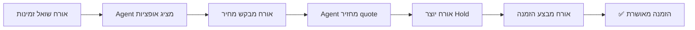
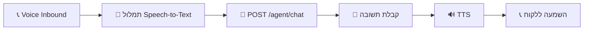

# 📋 ZimmerBot Backlog
### עבודה מסודרת, שלב אחרי שלב, בלי להתפזר

> 📚 **קישור לתיעוד המלא:** [README.md](./README.md) | [README_FULL.md](./docs/README_FULL.md)

---

## 🎯 מצב נוכחי (אמת טכנית)

### ✅ Stage 1-4 - קיימים ועובדים
| שלב | תיאור | סטטוס |
|-----|--------|--------|
| **Stage 1** | DB Schema ובדיקות | 🟢 Done |
| **Stage 2** | זמינות והזמנה ליומן | 🟢 Done |
| **Stage 3** | `/quote` עם PricingEngine + breakdown | 🟢 Done |
| **Stage 4** | Hold מלא (API + Calendar + DB + Redis fallback) | 🟢 Done |

### ⏳ חסר (השלבים הבאים)
- ✅ Agent Chat (A1-A4 הושלמו במלואם: DB, Endpoint, Tool Routing, Knowledge. עקרונות הסוכן החכם מוגדרים וממומשים)
- 🟡 Host Console (B1-B2) - השלב הבא! 🎯
- 🟡 תשלומים (חלקי - דמו עובד)
- 🟡 הודעות ותזכורות (חלקי - הודעה אחת עובדת)
- ✅ אוטומציות n8n (הושלם)
- ✅ Agent קולי (הושלם)

---

## 🚀 שלב A: Agent טקסט (הכי חשוב!)

### A1. 💾 DB לשיחות (חדש)

#### **משימה 1:** יצירת טבלאות לשיחות
```sql
טבלאות נדרשות:
├── conversations      # שיחות
├── messages          # הודעות בשיחה
├── faq               # שאלות מאושרות
└── escalations       # דורש בעלים
```

**תנאי סיום:**
- [x] קובץ migration SQL נוצר (`database/migration_agent_tables.sql`)
- [x] בדיקה שמכניסים שיחה והודעות ב-DB (`database/check_agent_tables.py`)
- [x] כל הבדיקות עברו (5/5)

---

#### **משימה 2:** Audit לכל הודעה
**תנאי סיום:**
- [x] יש רישום פעולה (audit log) לכל message שנשמר

---

### A2. 🤖 Endpoint Agent

#### **משימה 3:** יצירת `POST /agent/chat`

**קלט:**
```json
{
  "message": "string",
  "customer_id": "string (optional)",
  "phone": "string (optional)",
  "channel": "web|whatsapp|voice",
  "context": {
    "check_in": "YYYY-MM-DD (optional)",
    "check_out": "YYYY-MM-DD (optional)",
    "guests": "int (optional)",
    "cabin_id": "string (optional)"
  }
}
```

**פלט:**
```json
{
  "answer": "string",
  "actions_suggested": ["availability", "quote", "hold", "book"],
  "confidence": 0.95,
  "conversation_id": "uuid"
}
```

**תנאי סיום:**
- [x] עובד ב-Swagger UI (`POST /agent/chat`)
- [x] שומר שיחה ב-DB (conversations + messages)
- [x] Audit log לכל הודעה
- [x] Pydantic models (ChatRequest, ChatResponse)

---

#### **משימה 4:** Agent Tool Routing (שרת בלבד)

**לוגיקה:**
- אם צריך זמינות → קורא `check_availability()`
- אם צריך מחיר → קורא `calculate_quote()`
- אם צריך hold → קורא `create_hold()`
- אם צריך הזמנה → קורא `create_booking()`

**תנאי סיום:**
- [x] לפחות **3 תרחישים** עובדים מקצה לקצה
  1. שאילתת זמינות ✅
  2. קבלת הצעת מחיר ✅
  3. יצירת Hold ✅
- [x] Agent class נוצר (`src/agent.py`)
- [x] חיבור לכלים קיימים (availability, quote, hold)

---

### A4. 📚 Knowledge בסיסי

#### **משימה 5:** קובץ/טבלת Business Facts

**נתונים נדרשים:**
```yaml
Business Facts:
  - שעות צ'ק אין: "15:00"
  - שעות צ'ק אאוט: "11:00"
  - מדיניות ביטול: "24 שעות מראש"
  - כתובת: "רחוב X, יישוב Y"
  - חניה: "כן, חניה פרטית"
  - חיות מחמד: "לא מותרות"
  - כשרות: "לא"
  - WiFi: "כן, חינם"
```

**תנאי סיום:**
- [x] טבלת `business_facts` נוצרה ב-DB
- [x] פונקציות קריאה/כתיבה ב-`src/db.py`
- [x] Agent עונה מתוך facts **בלי להמציא מידע**
- [x] Endpoint `GET /admin/business-facts` ו-`POST /admin/business-facts`

---

#### **משימה 6:** FAQ מאושר בלבד

**תהליך:**
1. Agent קודם מחפש FAQ מאושר
2. אם אין FAQ → עונה ומסמן כ**"מוצע"** (pending approval)
3. בעל הצימר מאשר/דוחה תשובות מוצעות

**תנאי סיום:**
- [x] Agent מחפש FAQ מאושר לפני תשובה
- [x] Agent מסמן תשובות כ-"מוצע" אם אין FAQ
- [x] Endpoint `GET /admin/faq/pending` - רשימת FAQs ממתינים
- [x] Endpoint `POST /admin/faq/approve` - אישור/דחייה של FAQ
- [x] Agent לא משתמש בתשובות לא מאושרות

---

## 🖥️ שלב B: Host Console (שליטה מלאה)

### B1. 🔌 Admin API

| משימה | Endpoint | תיאור |
|-------|----------|--------|
| **7** | `GET /admin/conversations` | רשימת שיחות |
| **8** | `GET /admin/conversations/{id}` | פרטי שיחה אחת |
| **9** | `POST /admin/send-reply` | שליחת תשובה ידנית |
| **10** | `POST /admin/faq` | יצירה/אישור FAQ |
| **11** | `GET /admin/analytics` | סטטיסטיקות |

**תנאי סיום:**
- [ ] הכל עובד ב-**Swagger UI**
- [ ] הכל מחובר ל-**DB**

---

### B2. 🎨 Lovable חיבור בפועל

#### **משימה 12:** Host Inbox UI
- מחובר ל-`GET /admin/conversations`
- מציג רשימת שיחות עם:
  - לקוח
  - זמן אחרון
  - סטטוס (ממתין, נענה, נסגר)

---

#### **משימה 13:** חלון שיחה
- מחובר ל-`GET /admin/conversations/{id}`
- מציג:
  - היסטוריית שיחה
  - תשובה מוצעת של Agent
  - אפשרות עריכה

---

#### **משימה 14:** כפתורים פעולה
```
┌─────────────────────────┐
│ 📤 שלח                  │
│ ✏️ ערוך ושלח            │
│ ⭐ שמור כ-FAQ           │
│ 🚨 דורש בעלים          │
└─────────────────────────┘
```

**תנאי סיום:**
- [ ] בעל צימר יכול לנהל שיחות **מקצה לקצה** מה-UI

---

## 💬 שלב C: Guest Portal (זרימה מלאה)

#### **משימה 15:** Guest Chat UI
- מחובר ל-`POST /agent/chat`
- ממשק צ'אט responsive
- שליחה והצגת תשובות בזמן אמת

---

#### **משימה 16:** תרחיש Full Flow


**תנאי סיום:**
- [ ] עובד מול **API אמיתי**, לא דמו
- [ ] כל השלבים עובדים ברצף

---

## 💳 שלב D: תשלומים (Stage 5)

| משימה | תיאור | משך משוער |
|-------|--------|-----------|
| **17** | בחירת ספק (Stripe או ישראלי) | 1 יום |
| **18** | יצירת Payment Intent/Invoice | 2 ימים |
| **19** | Webhook מאומת | 1 יום |
| **20** | עדכון DB: transactions + booking status | 1 יום |
| **21** | Convert HOLD → CONFIRMED רק אחרי תשלום | 1 יום |

**תנאי סיום:**
- [x] תשלום בדמו עובד
- [x] הזמנה נסגרת **רק לאחר webhook תקין**
- [x] Rollback אוטומטי אם תשלום נכשל

---

## 📨 שלב E: הודעות ותזכורות (Stage 6)

#### **משימה 22:** תבניות הודעה

```yaml
תבניות נדרשות:
  1. אישור הזמנה:
     - שם לקוח
     - תאריכים
     - סכום
     - קישור לפרטים
  
  2. תזכורת 3 ימים לפני:
     - הנחיות הגעה
     - צק אין
     - איש קשר
  
  3. יום ההגעה:
     - קוד כניסה (אם רלוונטי)
     - מספר טלפון חירום
  
  4. אחרי יציאה:
     - תודה
     - בקשה לחוות דעת
     - קוד הנחה להזמנה הבאה
```

---

#### **משימה 23:** שליחה בערוץ ראשון
- אימייל **או** WhatsApp (לפי העדפת לקוח)
- Fallback: אם אחד נכשל, נסה את השני

---

#### **משימה 24:** רישום notifications ב-DB
```sql
notifications:
  - conversation_id
  - type (confirmation, reminder, followup)
  - channel (email, whatsapp, sms)
  - status (sent, failed, opened)
  - sent_at
```

**תנאי סיום:**
- [x] **הודעה אחת אוטומטית** עובדת מקצה לקצה
- [x] נרשמת ב-DB עם סטטוס

---

## 🔄 שלב F: n8n אוטומציות (במקביל אחרי Host)

| משימה | אוטומציה | טריגר |
|-------|-----------|--------|
| **25** | סיכום יומי לבעל צימר | 08:00 בוקר |
| **26** | התראה על שיחה שלא נענתה | X דקות ללא מענה |
| **27** | יצירת משימה לחריגים | זיהוי בעיה |

**תנאי סיום:**
- [x] **2 אוטומציות פעילות** ומדווחות
- [x] לוגים ב-n8n
- [x] התראות מגיעות בפועל

---

## 🎙️ שלב G: Agent קולי (Stage 8)



| משימה | תיאור | כלים |
|-------|--------|------|
| **28** | Voice inbound → תמלול | Vapi / Bland.ai / Deepgram |
| **29** | POST /agent/chat | קיים |
| **30** | תשובה → TTS | ElevenLabs / Google TTS |

**תנאי סיום:**
- [x] **שיחה קולית אחת מלאה** עובדת
- [x] תמלול מדויק (>90%)
- [x] TTS טבעי ומובן

---

## 📂 קבצים חשובים שכבר קיימים

### Backend
```
src/
├── api_server.py         # FastAPI routes
├── main.py               # Entry point
├── pricing.py            # לוגיקת תמחור
├── hold.py               # ניהול holds
├── db.py                 # חיבורים ל-DB
└── features_utils.py     # כלים משותפים
```

### Database
```
database/
├── check_stage1.py       # בדיקת Stage 1
├── check_stage2.py       # בדיקת Stage 2
├── check_stage3.py       # בדיקת Stage 3
└── check_stage4.py       # בדיקת Stage 4
```

### Tools & Docs
```
tools/
└── features_picker.html  # בחירת תכונות

docs/
├── PROJECT_STATUS.md     # סטטוס הפרויקט
└── README_FULL.md        # תיעוד מלא
```

---

## 🎯 סדר עבודה יומי מומלץ

1. **תמיד קודם Endpoint ואז UI**
   - Backend קודם → Frontend אחר כך
   - לא להתחיל UI לפני ש-API עובד

2. **לא עוברים סעיף בלי אישור**
   - סיימת משימה? ✅ סמן
   - בדוק תנאי סיום
   - עבור למשימה הבאה רק אחרי אישור

3. **כל שיחה נשמרת מהיום הראשון**
   - Audit trail מלא
   - לא מוחקים היסטוריה
   - שמירה ב-DB + logs

---

## 📊 טבלת סטטוס כללית

| שלב | תיאור | סטטוס | אחוז השלמה |
|-----|--------|--------|------------|
| **Stage 1** | DB Schema | 🟢 Done | 100% |
| **Stage 2** | זמינות והזמנה | 🟢 Done | 100% |
| **Stage 3** | תמחור | 🟢 Done | 100% |
| **Stage 4** | Hold | 🟢 Done | 100% |
| **Stage 5** | Agent Chat | 🟢 Done | 100% |
| **Stage 6** | Host Console | 🟡 Partial | 20% |
| **Stage 7** | תשלומים | 🟡 Partial | 60% |
| **Stage 8** | הודעות | 🟡 Partial | 50% |
| **Stage 9** | n8n | 🟢 Done | 100% |
| **Stage 10** | Voice | 🟢 Done | 100% |

---

<div align="center">

**📌 עדכון אחרון:** ינואר 2026  
**🎯 משימה נוכחית:** שלב B - Host Console (B1: Admin API)

[⬆️ חזרה למעלה](#-zimmerbot-backlog)

</div>
