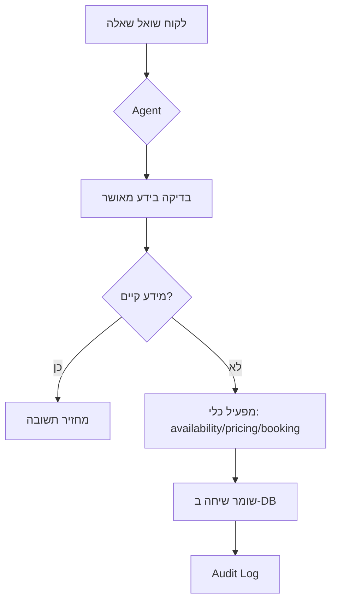

# 🏡 ZimmerBot - תיעוד מלא ותהליך פיתוח

> 📚 **לתיעוד המלא והמפורט:** [README_FULL.md](./docs/README_FULL.md) | [BACKLOG.md](./BACKLOG.md) | [עקרונות הסוכן החכם](./docs/AGENT_PRINCIPLES.md)

<div align="center">

**סוכן חכם לבעלי צימרים - מחליף מענה אנושי, משפר חווית לקוח ומגדיל הזמנות**

[](https://fastapi.tiangolo.com/)
[](https://www.postgresql.org/)
[](https://developers.google.com/calendar)

</div>

---

## 📋 תוכן עניינים

- [חזון הפרויקט](#-חזון-הפרויקט)
- [מטרות המערכת](#-מטרות-המערכת)
- [ארכיטקטורת Agent](#-ארכיטקטורת-agent)
- [ארכיטקטורת MVC](#️-ארכיטקטורת-mvc)
- [סטטוס נוכחי](#-סטטוס-נוכחי)
- [שלבים עתידיים](#-שלבים-עתידיים)
- [הערות חשובות](#-הערות-חשובות)

---

## 🎯 חזון הפרויקט

בניית **סוכן חכם (AI Agent)** לבעלי צימרים שמבצע את המשימות הבאות:

- ✅ מחליף מענה אנושי בשגרה יומיומית
- ✅ משפר את חווית הלקוח עם מענה מיידי
- ✅ מגדיל הזמנות באמצעות זמינות 24/7
- ✅ מפחית עומס תפעולי על בעל הצימר

---

## 🎯 מטרות המערכת

### יכולות ליבה

| תכונה | תיאור |
|-------|--------|
| 🕐 **מענה 24/7** | זמינות מלאה ללקוחות בכל שעות היממה |
| 📅 **בדיקת זמינות** | שאילתא ביומנים אמיתיים (Google Calendar) |
| 💰 **תמחור דינמי** | חישוב מחיר אוטומטי לפי תקופה, אורחים, מבצעים |
| 🔒 **Hold והזמנה** | שמירת תאריכים והמרה להזמנה מאושרת |
| 🤖 **למידה מתמשכת** | ענייה על שאלות נפוצות ושיפור מתמיד |
| 📊 **Dashboard** | ממשק ניהול מלא לבעל הצימר |

---

## 🧠 ארכיטקטורת Agent

### עקרונות התפעול



### ה-Agent מתנהל לפי:

#### ✅ מה הוא עושה:
- לא ממציא מידע מעצמו
- עובד **רק** לפי ידע מאושר (approved knowledge)
- מפעיל כלים ספציפיים:
  - `check_availability()` - בדיקת זמינות
  - `calculate_pricing()` - חישוב מחיר
  - `create_booking()` - יצירת הזמנה
- שומר כל שיחה ל-Database עם Audit Trail

#### 🎓 למידה ושיפור:
- למידה מתבצעת **רק באישור בעל הצימר**
- לא למידה אוטומטית לחלוטין
- בעל הצימר בוחר אילו תשובות להוסיף ל-Knowledge Base

---

### 🔍 עקרונות הסוכן החכם (הגדרה מלאה)

הסוכן החכם של ZimmerBot פועל לפי עקרונות ברורים:

#### 1. **DB and Calendar First** - תשובות מבוססות על מקורות אמת
- **זמינות ותפוס**: Google Calendar הוא מקור האמת היחיד
- **נתונים תפעוליים**: DB הוא מקור האמת להזמנות, לקוחות, לוגים
- **תמיד מאמת**: גם אם יש נתון ב-DB, בודק ביומן לפני תשובה על זמינות

#### 2. **אין המצאות** - אסור לנחש או להמציא
- אם אין נתון או לא הצלחת לבדוק מקור → אומר במפורש מה חסר
- לא ממציא מחירים, זמינות, או פרטי צימרים
- אם נכשל בבדיקת יומן → לא ממציא זמינות, מציין את הכשל

#### 3. **שקיפות** - הצגת מקורות בכל תשובה
- כל תשובה כוללת "מקורות" ברורים:
  - `db`: טבלאות ושדות שנבדקו
  - `calendar`: calendar_id והטווח שנבדק
- אם יש חפיפות → מציג סיכום אירועים מתנגשים

#### 4. **אבטחה** - הגנה על מידע רגיש
- לעולם לא מחזיר secrets, token.json, credentials.json, .env
- לא מדפיס מפתחות API או ערכי ENV
- שמירה על מינימום מידע רגיש בתשובות

#### 5. **זרימת עבודה מובנית** לכל שאלה:
1. **הבנת השאלה** - חילוץ ישויות (cabin_id, תאריכים, לקוח)
2. **גילוי מקורות** - בדיקת טבלאות רלוונטיות ב-DB
3. **ביצוע שאילתות** - שאילתות ממוקדות עם פרמטרים
4. **בדיקת זמינות ביומנים** - חובה כשמדובר בתאריכים/זמינות
5. **ניסוח תשובה** - תשובה קונקרטית עם מקורות

#### 6. **תמונות וגלריה**
- שליפת תמונות מה-DB לפי `images_urls`
- החזרת מערך URLs לתצוגת גלריה
- אם אין תמונות → מציין במפורש

#### 7. **למידה מצטברת** (בלי להמציא)
- כל שיחה נשמרת למסד (conversations/messages)
- שאלות שחוזרות נשמרות כ-FAQ רק באישור בעלים
- בזמן מענה: מחפש FAQ מאושר → DB תפעולי → בדיקת יומן → אם אין נתון: אומר שאין

---

## 🏗️ ארכיטקטורת MVC

### 📦 Model (Backend Logic)

**טכנולוגיות:**
- FastAPI - REST API Server
- Google Calendar API - ניהול יומנים
- Google Sheets - מקור נתונים ראשוני
- PostgreSQL - מסד נתונים ראשי
- Python - חישובים ולוגיקה עסקית

**קבצים עיקריים:**

```
backend/
├── main.py              # Entry point
├── api_server.py        # FastAPI routes
├── pricing.py           # לוגיקת תמחור
├── hold.py              # ניהול holds
├── db.py                # חיבורים ל-DB
└── features_utils.py    # כלים משותפים
```

**פונקציונליות:**
- ✅ חישוב זמינות מול Google Calendar
- ✅ חישוב מחיר דינמי
- ✅ שמירת הזמנות
- ✅ Audit Log מלא

---

### 🎨 View (Frontend)

**Lovable Projects - שני ממשקים:**

#### 1️⃣ Guest Portal (פורטל אורחים)
```
תכונות:
├── חיפוש תאריכים
├── בדיקת זמינות
├── חישוב מחיר
└── ביצוע הזמנה
```

#### 2️⃣ Host Console (קונסולת מארח)
```
תכונות:
├── צפייה בשיחות
├── ניהול הזמנות
├── עריכת FAQ
└── בקרה על Agent
```

**עקרון פיתוח:**
> ⚠️ **View לא מבצע לוגיקה עסקית**  
> View רק מציג נתונים וקורא ל-API

---

### 🎮 Controller (API & Automation)

#### FastAPI Endpoints

| Endpoint | Method | תיאור |
|----------|--------|--------|
| `/availability` | GET | בדיקת זמינות לתקופה |
| `/quote` | POST | קבלת הצעת מחיר |
| `/hold` | POST | שמירת תאריכים |
| `/book` | POST | אישור הזמנה |
| `/agent/chat` | POST | 🚧 בפיתוח |
| `/admin/*` | * | 🚧 עתידי |

#### n8n Workflows (אוטומציות)

```yaml
אוטומציות קיימות:
  - סיכום יומי למארח
  - התראות על חריגות
  - Follow-ups אוטומטיים

אוטומציות מתוכננות:
  - תזכורות טרום הגעה
  - סקרים לאחר עזיבה
  - ניהול ביטולים
```

---

## ✅ סטטוס נוכחי

### רכיבים פעילים

| רכיב | סטטוס | הערות |
|------|-------|-------|
| בדיקת זמינות | 🟢 עובד | מול Google Calendar |
| חישוב תמחור | 🟢 עובד | כולל מבצעים ושבתות |
| הזמנה ליומן | 🟢 עובד | יוצר אירוע ב-Calendar |
| שמירה ל-DB | 🟢 עובד | PostgreSQL מחובר |
| Agent Chat | 🟡 חלקי | A1-A4 הושלמו: DB, Endpoint, Tool Routing, Knowledge (Business Facts + FAQ). עקרונות הסוכן החכם מוגדרים וממומשים |
| Host Console | 🟡 חלקי | UI קיים, חיבור חלקי |

### 🔧 בבדיקות
- ✅ API endpoints - יציבים
- ✅ Google Calendar sync - פעיל
- ⏳ Agent conversation flow - בפיתוח
- ⏳ FAQ management - בפיתוח

---

## 🚀 שלבים עתידיים

### Phase 1: השלמת Agent Chat
- [x] Agent Chat בסיסי עם context (A1-A3 הושלמו)
- [x] שמירת שיחות ב-DB עם conversation history
- [x] Business Facts ו-FAQ מאושר (A4 הושלם)
- [x] עקרונות הסוכן החכם מוגדרים וממומשים (DB/Calendar first, אין המצאות, שקיפות)
- [x] תמיכה במיקום/מפות (Google Maps + Waze)
- [ ] שילוב GPT-4 / Claude (עתידי)
- [ ] Handoff למארח במקרה הצורך (עתידי)

### Phase 2: ממשק ניהול
- [ ] ניהול FAQ מלא
- [ ] אישור/דחייה של תשובות ללמידה
- [ ] דשבורד אנליטיקה
- [ ] ניהול תמחור ומבצעים

### Phase 3: אוטומציות מתקדמות
- [ ] n8n workflows נוספים
- [ ] סנכרון עם Airbnb/Booking
- [ ] תזכורות אוטומטיות
- [ ] דוחות כספיים

### Phase 4: Agent קולי 🎙️
- [ ] שילוב Vapi / Bland.ai
- [ ] שיחות טלפון אוטומטיות
- [ ] תמלול ושמירת שיחות
- [ ] דיווח למארח

---

## 📝 הערות חשובות

### ⚡ מסמך זה הוא מקור העומק

> 📌 **מסמך זה מכיל את כל התהליך, החשיבה, השלבים והניסויים.**  
> שום תוכן לא נמחק, אלא אורגן בצורה ברורה יותר.

### 📂 ניהול יומיומי

הניהול השוטף מתבצע דרך:
- **README.md** - תיעוד כללי ומבנה
- **BACKLOG.md** - משימות ותכנון

### 🔄 עקרונות עבודה
1. **תיעוד מלא** - כל החלטה מתועדת
2. **גרסאות** - שמירת היסטוריה של שינויים
3. **בדיקות** - כל תכונה נבדקת לפני production
4. **אבטחה** - API keys ב-environment variables

---

## 📞 יצירת קשר ותמיכה

**מפתח הפרויקט:**  
מנהל פרויקטים טכנולוגי - בונה כלים, תוכנות ואוטומציות

**מבנה הפרויקט:**
```
ZimmerBot/
├── backend/          # FastAPI + Logic
├── frontend/         # Lovable Projects
├── n8n/             # Workflows
├── docs/            # תיעוד נוסף
├── tests/           # בדיקות
└── README.md        # המסמך הזה
```

---

<div align="center">

**בנוי עם ❤️ לבעלי צימרים בישראל**

⭐ אם הפרויקט עזר לך, נשמח לכוכב!

</div>
